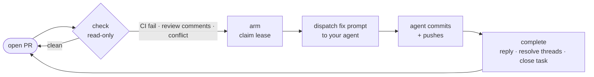

# agentic-pr-dash

Watch your open GitHub PRs, detect what's blocking each one — failing CI,
unaddressed review comments, merge conflicts — and let an agent resolve them,
with a **one-agent-per-PR ownership lease** so two runners never fight over the
same PR.

It comes in three layers you can adopt independently:

| Layer | Command | What it does |
|-------|---------|--------------|
| **Executor** | `agentic-pr-dash check` / `finalize` / `complete` / `arm` / `list-owned` | Stateless blocker detection, review settlement, and review-thread resolution. Shells out to `gh` + `git`; almost zero dependencies. |
| **Loop** | `agentic-pr-dash loop` | Continuously checks your PRs and dispatches the fix to a **configurable agent** (Claude Code, Codex, aider, any prompt-taking CLI). |
| **Dashboard** | `agentic-pr-dash serve` | A web view (FastAPI + HTMX) of every open PR's status, queued maintenance, and — optionally — your self-hosted CI runner fleet. |

It is **project-agnostic**: the GitHub repo, on-disk state directory, task
tracker, agent executor, and CI runner label are all configuration, not
hardcoded.

## Mental model

Think of each PR as a case file. `agentic-pr-dash` checks the file, decides
whether CI, merge conflicts, or review comments need attention, records who owns
the fix, and hands a prompt to the agent command your project configured.

It does not know how to fix your app. Your project decides which agent runs,
which tracker records work, which CI runners matter, and which safety policies
apply. For example, Gaia is one downstream app repo that uses `agentic-pr-dash`;
Gaia owns its beads, proof, test, Docker, and database policy, while
`agentic-pr-dash` owns generic PR state and one-agent-per-PR coordination.

## The board


Every open PR, grouped by what it needs — **Needs Attention** (failing CI or
unaddressed review comments), **Agent Working** (an agent holds the lease and is
actively fixing it), **CI Pending**, and **Clean** (ready to merge). The board
polls its local projection in the background; GitHub webhooks invalidate review
and CI observations as work changes, while bounded reconciliation catches missed
events.

### Harness status projection (optional)

The dashboard can consume schema-v1 `StatusReport` JSON from
[`agent-session-harness`](https://github.com/Boundless-Studios/agent-session-harness).
This is a wire contract rather than a package dependency, so the dashboard can
accept reports from any harness installation that emits the same versioned
shape:

```bash
agent-session-harness report --state <supervisor-state.json> --json \
  | agentic-pr-dash session-report --json --worktree-path "$PWD"
```

The command accepts one JSON object (up to 1 MiB) on standard input and returns
the normalized event and session identifiers. A report contains native
conversation identity, rotation identity, context usage, and activity:

```json
{
  "schema_version": 1,
  "runtime": "codex",
  "state": "warning",
  "chain_id": "pr-421-maintenance",
  "conversation_id": "019abc...",
  "generation": 2,
  "context_percent": 67.5,
  "context_tokens": 675000,
  "window_tokens": 1000000,
  "cumulative_tokens": 9500000,
  "confidence": "confident",
  "quiescence": "busy",
  "active": {"turns": 1, "tools": 1, "subagents": 0, "critical_sections": 0},
  "checkpoint_fingerprint": "abc123",
  "outbox_depth": 0
}
```

Fresh canonical status drives the card's working/idle state and exposes the
supervisor phase, context/window/cumulative tokens, chain, generation,
confidence, active work, checkpoint, and outbox depth. Reports older than 90
seconds or with unknown quiescence fall back to the existing process/activity
probes. Terminal lifecycle records stay terminal even if a late status report
or heartbeat arrives, and when a worktree has rotated through multiple
conversations the dashboard prefers its current non-terminal conversation.

Unknown extension fields are tolerated for forward compatibility. Raw prompts,
transcripts, tool inputs/outputs, and similarly private fields are rejected and
never written to the session registry.

Producers that may retry delivery can add a stable `event_id` extension; repeat
delivery of any of the last 256 keyed observations per session is idempotent,
including after registry compaction. Without an `event_id`, each invocation is
a new observation, so unchanged periodic snapshots still refresh liveness and
an A→B→A supervisor transition is preserved.

## Install

```bash
pip install agentic-pr-dash            # executor + loop
pip install 'agentic-pr-dash[serve]'   # + the web dashboard
```

Requires the [GitHub CLI](https://cli.github.com/) (`gh`) authenticated, and `git`.

## Quick start

```bash
# In a checkout with an open PR on the current branch:
agentic-pr-dash check            # exit 10 + a fix prompt on stdout if work is needed

# Run the loop, dispatching fixes to your agent of choice:
AGENTIC_PR_DASH_EXECUTOR='claude --dangerously-skip-permissions -p {prompt}' \
  agentic-pr-dash loop --once

# Or the dashboard:
agentic-pr-dash serve            # http://127.0.0.1:9000
```

## Configuration

Drop a `agentic-pr-dash.toml` at your repo root (see `agentic-pr-dash.example.toml`).
Everything is optional and has a project-agnostic default; any value can be
overridden with a `AGENTIC_PR_DASH_*` environment variable.

The config file is resolved in priority order: the `AGENTIC_PR_DASH_CONFIG` env
var (an explicit path), then a repo-local `agentic-pr-dash.toml` (walking up from
the cwd), then a global `~/.config/agentic-pr-dash/config.toml`. The global
fallback is handy for `serve`, which runs from an arbitrary cwd.

### GitHub authentication

The normal `gh` identity (including an App installation token in `GH_TOKEN`)
is used for reads and review replies. GitHub Apps cannot perform the GraphQL
`resolveReviewThread` mutation, so unattended App-based loops should also set
`AGENTIC_PR_DASH_GH_RESOLVE_TOKEN` to a dedicated machine-user fine-grained
personal access token. Scope that token only to the repositories the loop
maintains and grant **Pull requests: Read and write**. The token is used only
as the fallback identity for thread-resolution mutations; other GitHub calls
continue using the normal identity.

When `runner_label` describes runners hosted on the dashboard machine (or its
configured Docker daemon), set `local_runner_container_prefix` to their Docker
name prefix. The dashboard then derives online/busy/idle state locally and does
not need a GitHub token for runner inventory. Without a local prefix it falls
back to GitHub's repository runner endpoint, which requires **Repository
Administration: Read**; a missing permission is reported as an unauthorized
probe rather than runner downtime.

### GitHub observation and quota

For near-real-time review and CI updates, configure a GitHub repository webhook
whose payload URL is the dashboard's externally reachable
`/api/github/webhook` endpoint. Subscribe to `pull_request`,
`pull_request_review`, `pull_request_review_comment`,
`pull_request_review_thread`, `check_suite`, `check_run`, and `status`. Set the same
random secret through one of these process environment variables:

```bash
AGENTIC_PR_DASH_GITHUB_WEBHOOK_SECRET=<webhook-secret>
# Or mount a secret file and set only its path:
AGENTIC_PR_DASH_GITHUB_WEBHOOK_SECRET_FILE=/run/secrets/pr-dashboard-webhook
```

The endpoint accepts at most 1 MiB, verifies GitHub's HMAC-SHA256 signature,
deduplicates delivery IDs, and returns `202` before refreshing. Bursts coalesce
into one refresh after two seconds. Never place the secret in the TOML file or
in a webhook URL. A dashboard bound only to localhost needs an authenticated
reverse proxy or tunnel before GitHub can deliver events to it.

Webhooks are optional. Without a reachable webhook, the dashboard still updates
its local projection every 15 seconds, rechecks nonterminal CI every 30 seconds,
conditionally reconciles the open-PR list every 15 minutes, refreshes rich
GraphQL-only metadata at least hourly, and performs a full review reconciliation
every hour. Manual Refresh bypasses those timers.

Background GraphQL observation is capped at 500 cost points per rolling hour and
protects a 1,000-point reserve for explicit operator and maintenance gates.
Override the defaults when necessary with
`AGENTIC_PR_DASH_GRAPHQL_BACKGROUND_HOURLY_BUDGET` and
`AGENTIC_PR_DASH_GRAPHQL_MAINTENANCE_RESERVE` (the shorter `APD_` prefixes are
also accepted). The dashboard quota chip and `/api/quota` expose remaining and
reset time, latest query cost, rolling cost by caller/work class, cache hit rate,
and active degradation/backoff. Before the first valid GitHub rate-limit sample,
the chip explicitly reports **GitHub quota unobserved**.

```toml
[project]
# repo = "owner/name"          # auto-detected from the git remote if omitted
state_dir = ".agentic-pr-dash"     # where ownership markers + maintenance state live
tracker = "none"                # "none" | "beads" | "github-issues"
executor = "claude --dangerously-skip-permissions -p {prompt}"
discovery_names = ["claude", "codex"]   # process names treated as live agents
# runner_label = "my-ci-fleet"  # self-hosted runner label; omit to hide the runner panel
# local_runner_container_prefix = "gha-runner-"  # credential-free local Docker probe
```

### Task tracker (optional)

When a PR needs work, the loop can open a tracked task and close it when the PR
is clean. This is **off by default** — the flow works purely off PR state.
Built-in adapters:

- `none` — track nothing (default).
- `github-issues` — open/close a GitHub Issue (de-duped by a hidden marker).
- `beads` — the [`bd`](https://github.com/steveyegge/beads) CLI.

### Agent executor

`loop` dispatches the fix prompt to whatever CLI you configure. Use `{prompt}`
as the injection point:

```toml
executor = "claude --dangerously-skip-permissions -p {prompt}"
executor = "codex exec --full-auto {prompt}"
executor = "aider --message {prompt} --yes"
```

## The agentic review loop

Each tick, the loop walks your open PRs and runs `check` on every one — a
read-only pass over GitHub that classifies the PR as **clean**, **CI failing**,
**review comments**, or **merge conflict**. When a PR needs work it does three
things:

1. **Claims a lease** (`arm`) — writes an ownership marker stamped with the
   session id, pid, a short **heartbeat**, and a longer **fix lease**.
2. **Dispatches the fix** — hands a generated prompt (the failing CI logs plus
   the exact unresolved review comments) to your configured agent.
3. **Completes** (`complete`) — once the agent commits and pushes, it replies on
   each review thread it addressed, **resolves** the thread, and closes the
   tracked task — but only if the PR is genuinely clean again.



### Bounded, provider-neutral review settlement

`agentic-pr-dash finalize` is the shared completion gate for interactive agents
and repository hooks. Reviewer selection stays outside this project: a review
policy declares provider-neutral slots (including double-reviewer topologies),
and `agent-review-coordinator` records their results and finding dispositions.
The dashboard adds live GitHub, CI, mergeability, and change-request state. A
completed GitHub review submitted against the current head supplies a configured
backstop slot; PR-author, stale-head, pending, or malformed review records do
not. Codex's clean-result issue-comment format is adapted into the same evidence
contract because GitHub does not expose that outcome as a formal review
submission. This compatibility adapter does not select or require Codex; other
reviewers continue to qualify through ordinary GitHub reviews. The adapter
trusts only the Codex GitHub App identity and resolves its short reviewed-commit
SHA through GitHub before matching the immutable PR head.

```bash
agentic-pr-dash finalize \
  --policy config/review-policy.yaml \
  --ledger .agentic-review/ledger.json \
  --stabilization-seconds 30 \
  --json
```

`--ledger` defaults to `.agentic-pr-dash/review-ledger.json` below `--cwd`.
When a policy is configured, a missing ledger blocks an open PR but remains a
no-op on a branch with no PR. `stop-gate --policy ...` uses this same behavior
and maps unsettled state or observation failure to its blocking exit code.

Exit `0` means two identical observations were fully green; `10` means work
remains; `2` means GitHub or another observation source was unavailable. The
gate never turns an unavailable review-thread read into a clean result.

P1 findings must be addressed. P2 findings must be evaluated individually:
`complete --defer <thread> --severity P2 --reason <rationale>` records a
deliberate non-fix disposition, with an optional existing `--ticket`. It never
creates tracker work. For a P2 declared only in a top-level review body, use
`complete --defer review:<review-database-id> --severity P2 --reason
<rationale>`. If that body declares multiple findings, address one at a time
with `review:<review-database-id>:<ordinal>`. P1 deferral and bulk
`--sweep-p2` are refused.

### One agent per PR

The marker's **heartbeat** proves a runner's loop is alive and ticking; the
**fix lease** covers the long, tick-less stretch while an agent is mid-fix.
A second runner — say a detached `loop` running next to your in-editor session —
**defers** while another owner's heartbeat or fix lease is still fresh, and
pid-liveness reaps a crashed owner immediately. The result: a PR is only ever
worked by one agent at a time — no double-fixing, no clobbered commits.

Coordinator-backed claims are fenced by the `agent-coordinator` v0.2.0 contract,
pinned to its immutable commit (`d558062`). The dashboard carries both
`claim_id` and the monotonic `lease_epoch` through heartbeat and release
operations, so a stale owner cannot mutate a claim after it has been reclaimed.


*An agent holding the lease on PR #421 — addressing the reviewer's comment and
the failing unit test, with the heartbeat and progress timestamps ticking.*

For maintainers, see [Architecture](docs/ARCHITECTURE.md) for the setup model,
configuration contract, runtime flows, data model, and code map.

### Durable PR ledger — surviving worktree teardown (BOU-1587)

Ownership markers live *inside* a worktree (`<state_dir>/pr-watch.armed`). When a
worktree is torn down (a bug-bash session finishes a lane and reclaims the disk),
its marker disappears and the PR would silently drop out of `list-owned` even
though it still has unresolved review threads. To prevent that, every `arm` also
appends to a **durable, worktree-independent ledger**:

```
~/.gaia/pr-watch/ledger/session-<id>.jsonl   # {pr, branch, worktree, opened_at, baseline_sha, repo}
```

The ledger is keyed by session, lives under `$HOME` (outside any worktree), and is
the source of truth for "PRs this session opened." Entries are scoped by `repo`
(GitHub `owner/name`) so a session that spans multiple checkouts keeps a same-number
PR in each repo distinct; `reconcile-prs --cwd <repo>` only acts on that repo's PRs.
Legacy entries written before repo scoping (no `repo` field) are still honored.
Override its location with `GAIA_PR_LEDGER_DIR` (and the orphan-claim dir with
`GAIA_PR_CLAIM_DIR`).

**`reconcile-prs`** unions live-worktree PRs with detached ledger PRs (worktree
gone) and fetches each one's live review-thread + CI state directly from GitHub,
emitting one JSON record per line, **severity-first** (P1 review threads, then
thread count). Merged/closed PRs are pruned from the ledger as it runs:

```bash
agentic-pr-dash reconcile-prs --session-id <id> --cwd . [--adopt-orphans]
# {"pr":2064,"url":".../pull/2064","worktree_present":false,"unresolved_threads":5,"ci_failing":false,"p1":true,...}
```

A record with `worktree_present:false` and `unresolved_threads>0` is the
`No worktree / Awaiting Fixes` state: recreate the worktree to fix, or hand it
off — never report it ready-to-merge. The **stop-gate** now blocks idle (exit 2)
on any such detached owned PR, naming the PR URL and the required work.

`pr_has_unresolved_review_threads(pr, cwd)` keeps a PR out of any ready-to-merge
batch when it has a non-outdated unresolved review thread, even if CI is green.

**Orphan recovery.** `reconcile-prs --adopt-orphans` lets a *running* session
claim PRs whose owning session has **died** (worktree gone *and* the session is
terminal / its pid dead). Claims are arbitrated by an exclusive
`~/.gaia/pr-watch/claims/pr-<N>.json` file: exactly one live session wins, and a
claim held by a dead pid is taken over. The claimed PR is appended to the live
session's ledger and surfaced as blocked work — so abandoned PRs get reclaimed
instead of lingering unmonitored.

## Labeled-stash discipline (`agentic-pr-dash stash`)

`git stash` refs are shared across **every worktree** of a repo, and
`stash@{n}` is a stack *index* that shifts whenever any worktree pushes or
drops. With multiple agents working sibling worktrees (exactly what this
package orchestrates), a bare `git stash pop` can grab a *foreign* session's
WIP — resolve-then-act on `stash@{n}` is a TOCTOU race.

The `stash` subcommand ships the race-safe discipline as a package capability:

```bash
agentic-pr-dash stash push -m "<branch>: <purpose>"   # label is REQUIRED
agentic-pr-dash stash apply "<label-substring>"       # applies by pinned COMMIT HASH
agentic-pr-dash stash drop "<label-substring>"        # re-verifies before AND after the drop
agentic-pr-dash stash list                            # read-only
```

Semantics: the label is resolved to a `(commit hash, stash@{n})` pair in **one**
`git stash list` invocation (hash pinned at the instant the index is read);
`apply` acts on the commit hash directly (immune to index shifts); `drop`
re-verifies `git rev-parse stash@{n}` still equals the pinned hash immediately
before dropping, then **post-verifies** the `Dropped <ref> (<hash>)` output —
git has no compare-and-swap drop, so if the stack shifted inside the drop
window and a foreign entry was removed, it is **restored** via
`git stash store` and the command aborts loudly. Empty, blank, zero-match, or
ambiguous labels **fail closed** (an empty label would substring-match every
entry). There is deliberately no `pop` — it applies *and* drops in one step
and cannot name a survivable undo.

**Recommended consumer guard policy** (mirrors gaia's allowlist-of-canonical-forms
posture, BOU-2031/PR #2577): rather than enumerating bad `git stash` shapes
(regex evasions win that game), allow **only** the canonical race-safe forms and
route everything else to a prompt/deny:

* `git stash list|show ...` — read-only, always safe.
* `git stash push` whose only tokens are exactly one non-empty `-m|--message`
  label, optional `-u|--include-untracked`, and optional pathspecs after a
  trailing `--`.
* `git stash apply` of an explicit stash **commit hash** — hash-pinned, immune
  to index shifts. `stash@{n}` *index* forms are **not** allowlisted: they are
  the same shifting-index race this wrapper exists to close (an index listed a
  moment ago can point at a foreign entry by the time the command runs), and
  `git stash drop` has no hash form or compare-and-swap at all — route apply
  and drop through the wrapper instead.
* `agentic-pr-dash stash <push|apply|drop|list> ...` — this wrapper.
* Every other `git stash ...` shape (notably bare `push`, any `pop`, and any
  `stash@{n}` index form) → ask/deny.

## License

MIT
