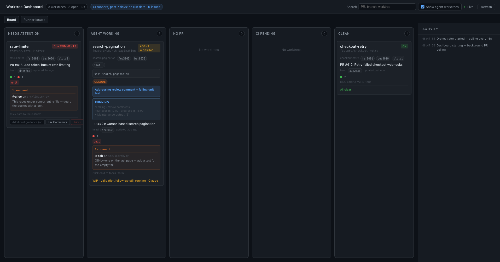
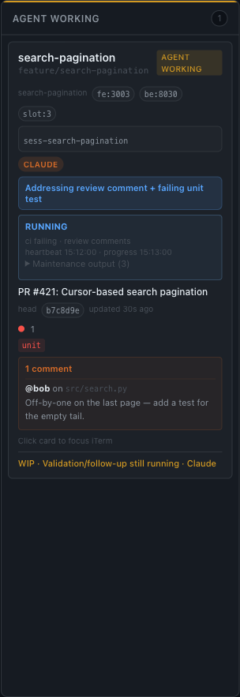

# agentic-pr-dash

Watch your open GitHub PRs, detect what's blocking each one — failing CI,
unaddressed review comments, merge conflicts — and let an agent resolve them,
with a **one-agent-per-PR ownership lease** so two runners never fight over the
same PR.

It comes in three layers you can adopt independently:

| Layer | Command | What it does |
|-------|---------|--------------|
| **Executor** | `agentic-pr-dash check` / `complete` / `arm` / `list-owned` | Stateless, read-only blocker detection + review-thread resolution. Shells out to `gh` + `git`; almost zero dependencies. |
| **Loop** | `agentic-pr-dash loop` | Continuously checks your PRs and dispatches the fix to a **configurable agent** (Claude Code, Codex, aider, any prompt-taking CLI). |
| **Dashboard** | `agentic-pr-dash serve` | A web view (FastAPI + HTMX) of every open PR's status, queued maintenance, and — optionally — your self-hosted CI runner fleet. |

It is **project-agnostic**: the GitHub repo, on-disk state directory, task
tracker, agent executor, and CI runner label are all configuration, not
hardcoded.

## The board



Every open PR, grouped by what it needs — **Needs Attention** (failing CI or
unaddressed review comments), **Agent Working** (an agent holds the lease and is
actively fixing it), **CI Pending**, and **Clean** (ready to merge). The board
polls GitHub in the background; cards update live as CI finishes and agents make
progress.

## Install

```bash
pip install agentic-pr-dash            # executor + loop
pip install 'agentic-pr-dash[serve]'   # + the web dashboard
```

Requires the [GitHub CLI](https://cli.github.com/) (`gh`) authenticated, and `git`.

## Quick start

```bash
# In a checkout with an open PR on the current branch:
agentic-pr-dash check            # exit 10 + a fix prompt on stdout if work is needed

# Run the loop, dispatching fixes to your agent of choice:
AGENTIC_PR_DASH_EXECUTOR='claude --dangerously-skip-permissions -p {prompt}' \
  agentic-pr-dash loop --once

# Or the dashboard:
agentic-pr-dash serve            # http://127.0.0.1:9000
```

## Configuration

Drop a `agentic-pr-dash.toml` at your repo root (see `agentic-pr-dash.example.toml`).
Everything is optional and has a project-agnostic default; any value can be
overridden with a `AGENTIC_PR_DASH_*` environment variable.

The config file is resolved in priority order: the `AGENTIC_PR_DASH_CONFIG` env
var (an explicit path), then a repo-local `agentic-pr-dash.toml` (walking up from
the cwd), then a global `~/.config/agentic-pr-dash/config.toml`. The global
fallback is handy for `serve`, which runs from an arbitrary cwd.

```toml
[project]
# repo = "owner/name"          # auto-detected from the git remote if omitted
state_dir = ".agentic-pr-dash"     # where ownership markers + maintenance state live
tracker = "none"                # "none" | "beads" | "github-issues"
executor = "claude --dangerously-skip-permissions -p {prompt}"
discovery_names = ["claude", "codex"]   # process names treated as live agents
# runner_label = "my-ci-fleet"  # self-hosted runner label; omit to hide the runner panel
```

### Task tracker (optional)

When a PR needs work, the loop can open a tracked task and close it when the PR
is clean. This is **off by default** — the flow works purely off PR state.
Built-in adapters:

- `none` — track nothing (default).
- `github-issues` — open/close a GitHub Issue (de-duped by a hidden marker).
- `beads` — the [`bd`](https://github.com/steveyegge/beads) CLI.

### Agent executor

`loop` dispatches the fix prompt to whatever CLI you configure. Use `{prompt}`
as the injection point:

```toml
executor = "claude --dangerously-skip-permissions -p {prompt}"
executor = "codex exec --full-auto {prompt}"
executor = "aider --message {prompt} --yes"
```

## The agentic review loop

Each tick, the loop walks your open PRs and runs `check` on every one — a
read-only pass over GitHub that classifies the PR as **clean**, **CI failing**,
**review comments**, or **merge conflict**. When a PR needs work it does three
things:

1. **Claims a lease** (`arm`) — writes an ownership marker stamped with the
   session id, pid, a short **heartbeat**, and a longer **fix lease**.
2. **Dispatches the fix** — hands a generated prompt (the failing CI logs plus
   the exact unresolved review comments) to your configured agent.
3. **Completes** (`complete`) — once the agent commits and pushes, it replies on
   each review thread it addressed, **resolves** the thread, and closes the
   tracked task — but only if the PR is genuinely clean again.


### One agent per PR

The marker's **heartbeat** proves a runner's loop is alive and ticking; the
**fix lease** covers the long, tick-less stretch while an agent is mid-fix.
A second runner — say a detached `loop` running next to your in-editor session —
**defers** while another owner's heartbeat or fix lease is still fresh, and
pid-liveness reaps a crashed owner immediately. The result: a PR is only ever
worked by one agent at a time — no double-fixing, no clobbered commits.



*An agent holding the lease on PR #421 — addressing the reviewer's comment and
the failing unit test, with the heartbeat and progress timestamps ticking.*

### Durable PR ledger — surviving worktree teardown (BOU-1587)

Ownership markers live *inside* a worktree (`<state_dir>/pr-watch.armed`). When a
worktree is torn down (a bug-bash session finishes a lane and reclaims the disk),
its marker disappears and the PR would silently drop out of `list-owned` even
though it still has unresolved review threads. To prevent that, every `arm` also
appends to a **durable, worktree-independent ledger**:

```
~/.gaia/pr-watch/ledger/session-<id>.jsonl   # {pr, branch, worktree, opened_at, baseline_sha, repo}
```

The ledger is keyed by session, lives under `$HOME` (outside any worktree), and is
the source of truth for "PRs this session opened." Entries are scoped by `repo`
(GitHub `owner/name`) so a session that spans multiple checkouts keeps a same-number
PR in each repo distinct; `reconcile-prs --cwd <repo>` only acts on that repo's PRs.
Legacy entries written before repo scoping (no `repo` field) are still honored.
Override its location with `GAIA_PR_LEDGER_DIR` (and the orphan-claim dir with
`GAIA_PR_CLAIM_DIR`).

**`reconcile-prs`** unions live-worktree PRs with detached ledger PRs (worktree
gone) and fetches each one's live review-thread + CI state directly from GitHub,
emitting one JSON record per line, **severity-first** (P1 review threads, then
thread count). Merged/closed PRs are pruned from the ledger as it runs:

```bash
agentic-pr-dash reconcile-prs --session-id <id> --cwd . [--adopt-orphans]
# {"pr":2064,"url":".../pull/2064","worktree_present":false,"unresolved_threads":5,"ci_failing":false,"p1":true,...}
```

A record with `worktree_present:false` and `unresolved_threads>0` is the
`No worktree / Awaiting Fixes` state: recreate the worktree to fix, or hand it
off — never report it ready-to-merge. The **stop-gate** now blocks idle (exit 2)
on any such detached owned PR, naming the PR URL and the required work.

`pr_has_unresolved_review_threads(pr, cwd)` keeps a PR out of any ready-to-merge
batch when it has a non-outdated unresolved review thread, even if CI is green.

**Orphan recovery.** `reconcile-prs --adopt-orphans` lets a *running* session
claim PRs whose owning session has **died** (worktree gone *and* the session is
terminal / its pid dead). Claims are arbitrated by an exclusive
`~/.gaia/pr-watch/claims/pr-<N>.json` file: exactly one live session wins, and a
claim held by a dead pid is taken over. The claimed PR is appended to the live
session's ledger and surfaced as blocked work — so abandoned PRs get reclaimed
instead of lingering unmonitored.

## License

MIT
