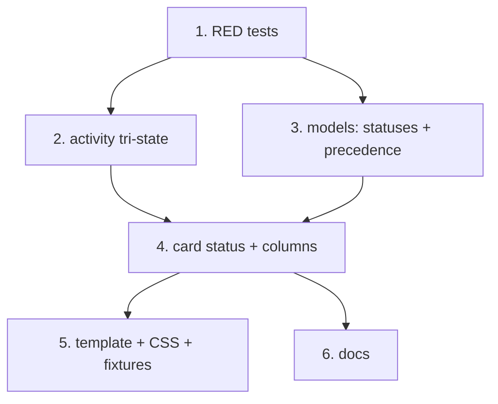

# BOU-2365 — Distinguish active work from idle/waiting live sessions

## Problem

The dashboard conflates **session/process liveness** with **actual work**. Three
distinct paths all collapse into `PRStatus.AGENT_WORKING`:

1. `app.py:_harness_activity_state` maps every member of
   `_HARNESS_TRANSITION_STATES` — including the wind-down phases `draining`,
   `stopping`, `stopped` — to `"working"`.
2. `app.py:_resolve_agent_working` falls back to `live` (a CPU-discovered
   process) when no activity signal exists, so a bare live process reads as
   working.
3. `app.py:_card_status` returns `AGENT_WORKING` whenever `has_active_agents`.

Observed repro (BOU-2362 / PR #2780): PR merged, quality gates green, worktree a
cleanup candidate, harness `Draining`, Codex conversation still alive because
stop-hook/user messages kept it open → card parked under **Agent Working**.

## Desired state model

| State | Meaning |
|---|---|
| `working` (**Agent Working**) | Actively coding, running tests, or remediating PR/CI feedback |
| `waiting` (**Waiting**) | A live session that is idle — awaiting user input, awaiting external checks, or winding down |
| `ready_cleanup` (**Ready / Cleanup**) | Deliverable merged/closed; worktree reclaimable even if the chat process lingers |

## Design

### 1. Three-valued activity signal (`app.py`)

Split the single boolean `agent_working` into a tri-state
`"working" | "waiting" | "none"`.

* Split `_HARNESS_TRANSITION_STATES` into:
  * `_HARNESS_ACTIVE_TRANSITION_STATES = {checkpointing, checkpointed, fencing,
    fenced, claiming, launching, awaiting_ack}` → `working` (rotation machinery
    genuinely mid-flight and short-lived).
  * `_HARNESS_WAITING_STATES = {draining, stopping, stopped, blocked}` →
    `waiting` (wind-down / blocked — never active coding).
* `_harness_activity_state` returns `working | waiting | none`
  (quiescence `idle` now maps to `waiting` instead of `idle`).
* `_legacy_agent_activity_state` returns `waiting` where it returned `idle`.
* `_resolve_agent_activity` (replaces `_resolve_agent_working`): when there is
  no activity signal at all, a bare live process yields `waiting`, **not**
  `working` — this is acceptance criterion #1. Sessions with no activity hook
  that are genuinely working are still caught by the maintenance-state branch of
  `_card_status` (loop dispatches set `MaintenanceStatus.RUNNING`) and by
  `_dashboard_dispatch_inflight`, which reads the orchestrator's in-flight set
  so a just-dispatched executor is working before it is CPU-visible.

### 2. Waiting reason

New `WorktreeCard.waiting_reason` (`user input` | `external checks` |
`winding down`), derived in the card builders:

* harness wind-down state → `winding down`
* `pr.ci_watch_pending` or `pr.status == CI_PENDING` → `external checks`
* otherwise → `user input`

Rendered on the card as `Waiting · <reason>`.

### 3. Ready / Cleanup

`_selected_worktree_cleanup_reason` is also the gate for real worktree removal
actions, so it is **not** loosened. Instead the card builder computes a separate
*display* signal `_worktree_is_reclaimable`, which calls
`selected_worktree_cleanup_reason` with an **empty** agent list — a lingering
live process no longer hides the terminal state, while the dirty-tree and
protected-worktree guards still apply. `cleanup_candidate` (which drives the
card's cleanup button) keeps its current, conservative computation.

### 4. New statuses + board columns (`models.py`, `app.py`)

* `PRStatus.AGENT_WAITING = "agent_waiting"` → column **Waiting**
* `PRStatus.READY_CLEANUP = "ready_cleanup"` → column **Ready / Cleanup**

Both are card-derived only. `Orchestrator._compute_status` never emits them, so
dispatch/loop behaviour is untouched.

**Column and chip are decoupled.** `status` (the column) answers *what does this
PR need*; `session_activity` + `agent_state` (the chip) answer *what is the
session doing*. A card with a PR keeps its PR status, so a clean PR with an idle
session stays in `Clean` — otherwise the bug-bash "ready to merge" banner, which
counts `status == CLEAN`, would drop to zero. Only a worktree with **no** PR is
routed by activity alone.

`_card_status(pr, activity, reclaimable)`:

```
reclaimable and activity != "working"           -> READY_CLEANUP
pr:
  activity == "working" or maintenance active   -> AGENT_WORKING
  pr.status CLEAN and review_comments           -> HAS_COMMENTS
  otherwise                                     -> pr.status
no pr:
  activity == "working"                         -> AGENT_WORKING
  activity == "waiting"                         -> AGENT_WAITING
  otherwise                                     -> NO_PR
```

### 5. `agent_state` precedence (`models.py`)

Documented, in order:

```
failed > ready_cleanup > queued(maintenance) > working > awaiting_fixes
       > ci_failing > merge_conflict > waiting > ci_pending > no_pr > clean
```

with the existing maintenance override (`RUNNING`/`WAITING_FOR_PUSH` → working,
`QUEUED`/`SIGNALED` → queued) evaluated after `ready_cleanup`. `waiting` fires on
`session_activity == "waiting"` as well as `PRStatus.AGENT_WAITING`, so it
outranks the passive states (`ci_pending`, `no_pr`, `clean`) without ever masking
an actionable PR.

## Tasks

1. **RED test bead** — `tests/test_bou2365_activity_vs_liveness.py` covering the
   five required scenarios; must fail before any implementation.
2. Activity tri-state + harness state split (`app.py`).
3. New statuses, `waiting_reason`, `agent_state` precedence (`models.py`).
4. Card status/columns + reclaimable display signal (`app.py`).
5. Template + CSS for the two new states, plus proof-fixture cards.
6. Precedence documentation in `docs/ARCHITECTURE.md`.

## Definition of done

- [ ] Five precedence scenarios covered by tests and green
- [ ] Existing suite green (`python3 -m pytest -q`)
- [ ] `ruff format --check` clean (CI gates on it)
- [ ] Precedence table documented in `docs/ARCHITECTURE.md`


